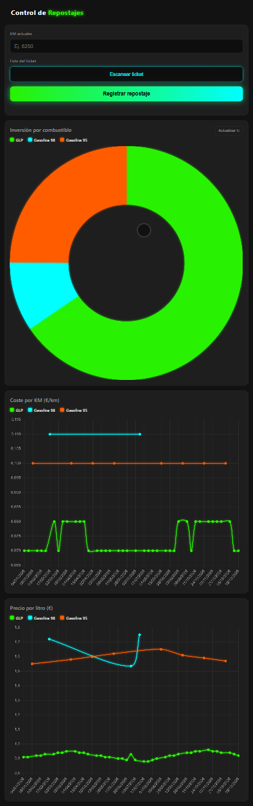

# RefuelControl_60F10

## Objetivo del Proyecto

RefuelControl_60F10 es una aplicación progresiva web (PWA) para gestionar y registrar repostajes de vehículos de forma eficiente. La aplicación permite:

- Capturar recibos de gasolinera mediante foto
- Procesar automáticamente la información del recibo usando IA (Google Gemini)
- Almacenar datos de repostaje en Google Sheets
- Acceder a la aplicación offline y sincronizar cuando hay conexión
- Mantener un registro completo y automatizado de costos de combustible



---

## Arquitectura de Seguridad

La aplicación implementa una arquitectura segura de tres capas:

```
┌─────────────────────┐
│   Frontend (PWA)    │
│  HTML/CSS/JavaScript│
└──────────┬──────────┘
           │
           │ Request seguro con token
           ↓
┌─────────────────────┐
│ Netlify Function    │
│  (Backend)          │
└──────────┬──────────┘
           │
           │ Llamada a Google Apps Script
           ↓
┌──────────────────────┐
│ Google Apps Script   │
│ (Lógica de Negocio)  │
│ - API Gemini         │
│ - Google Sheets      │
│ - Google Drive       │
└──────────────────────┘
```

### Flujo de Seguridad

1. **Frontend (Cliente)**
   - La PWA se ejecuta en el navegador del usuario
   - Captura datos y envía peticiones a Netlify Function
   - Incluye un token compartido en las cabeceras

2. **Netlify Function (Backend)**
   - Valida el token SHARED_TOKEN para autorizar la petición
   - Recibe la URL del script de Google Apps Script
   - Reenvía la solicitud de forma segura
   - Protege las credenciales de Google

3. **Google Apps Script (Servidor de Datos)**
   - Recibe la petición de Netlify Function
   - Procesa imágenes con la API de Google Gemini
   - Escribe datos en Google Sheets
   - Guarda recibos en Google Drive

---

## Guía de Despliegue

### 1. Despliegue en Netlify

#### Configuración de Variables de Entorno

1. Accede a tu sitio en [Netlify Dashboard](https://app.netlify.com/)
2. Ve a **Site configuration** → **Environment variables**
3. Añade las siguientes variables:

| Variable | Descripción | Ejemplo |
|----------|-------------|---------|
| `GOOGLE_SCRIPT_URL` | URL de despliegue de tu Google Apps Script | `https://script.google.com/macros/d/{SCRIPT_ID}/usercopy` |
| `SHARED_TOKEN` | Token de autenticación compartido | `tu_token_secreto_largo_aqui` |

#### Pasos:

1. En la interfaz de Site configuration, haz clic en **Environment variables**
2. Haz clic en **Edit variables**
3. Añade:
   - **Key:** `GOOGLE_SCRIPT_URL` | **Value:** `[Tu URL de Google Apps Script]`
   - **Key:** `SHARED_TOKEN` | **Value:** `[Tu token seguro]`
4. Haz clic en **Save**
5. Despliega de nuevo tu sitio para que los cambios surtan efecto

**⚠️ Importante:** Usa un token fuerte y aleatorio. Ejemplo:
```
SHARED_TOKEN=abc123def456ghi789jkl012mno345pqr678stu901vwx
```

---

### 2. Despliegue en Google Apps Script

#### Configuración de Propiedades del Script

1. Abre tu proyecto en [Google Apps Script](https://script.google.com/)
2. Ve a **Configuración** → **Propiedades del script** (o busca el ícono de engranaje ⚙️)
3. Añade las siguientes propiedades de secuencia:

| Propiedad | Descripción | Ejemplo |
|-----------|-------------|---------|
| `GEMINI_API_KEY` | Clave de API de Google Gemini | `AIzaSyD...` |
| `CARPETA_RECIBOS_ID` | ID de la carpeta de Google Drive donde guardar recibos | `1a2b3c4d5e6f7g8h9i0j` |
| `SHARED_TOKEN` | Token de autenticación (debe coincidir con Netlify) | `abc123def456ghi789jkl012mno345pqr678stu901vwx` |

#### Pasos Detallados:

1. **Abre el Editor de Google Apps Script**
   - Ve a [script.google.com](https://script.google.com)
   - Abre tu proyecto

2. **Accede a Propiedades del Script**
   - Haz clic en el ícono de **engranaje ⚙️** (Configuración) en la barra lateral izquierda
   - Selecciona **Propiedades del script**

3. **Añade cada propiedad:**

   **Para GEMINI_API_KEY:**
   - **Propiedad:** `GEMINI_API_KEY`
   - **Valor:** Tu clave de API de Google Gemini
   - [Obtén tu clave aquí](https://aistudio.google.com/apikey)

   **Para CARPETA_RECIBOS_ID:**
   - **Propiedad:** `CARPETA_RECIBOS_ID`
   - **Valor:** El ID de la carpeta de Google Drive
   - [Cómo obtener el ID de la carpeta](https://webapps.stackexchange.com/questions/166657/how-do-i-get-a-google-drive-folder-id)

   **Para SHARED_TOKEN:**
   - **Propiedad:** `SHARED_TOKEN`
   - **Valor:** El mismo token que configuraste en Netlify
   - Asegúrate de que coincida exactamente

4. **Guarda los cambios**
   - Haz clic en **Guardar** o presiona `Ctrl + S`

5. **Despliega tu script**
   - Ve a **Desplegar** → **Nueva implementación**
   - Selecciona tipo: **API ejecutable**
   - Haz clic en **Desplegar**
   - Copia la URL de despliegue (será similar a: `https://script.google.com/macros/d/{SCRIPT_ID}/usercopy`)
   - Esta URL es tu `GOOGLE_SCRIPT_URL` para Netlify

#### Acceso a las Propiedades en el Código

En tu código de Google Apps Script, accede a las propiedades así:

```javascript
const GEMINI_API_KEY = PropertiesService.getScriptProperties().getProperty('GEMINI_API_KEY');
const CARPETA_RECIBOS_ID = PropertiesService.getScriptProperties().getProperty('CARPETA_RECIBOS_ID');
const SHARED_TOKEN = PropertiesService.getScriptProperties().getProperty('SHARED_TOKEN');
```

---

## Checklist de Despliegue

- [ ] **Google Apps Script:** Crear/obtener las 3 propiedades del script
- [ ] **Google Apps Script:** Obtener GEMINI_API_KEY de Google AI Studio
- [ ] **Google Apps Script:** Obtener CARPETA_RECIBOS_ID de Google Drive
- [ ] **Google Apps Script:** Desplegar el script como API ejecutable
- [ ] **Netlify:** Añadir variable `GOOGLE_SCRIPT_URL` (URL de despliegue)
- [ ] **Netlify:** Añadir variable `SHARED_TOKEN` (mismo token que en Google Apps Script)
- [ ] **Netlify:** Redeploy del sitio
- [ ] **Prueba:** Verificar que la aplicación se conecta correctamente
- [ ] **Seguridad:** Cambiar tokens en producción si es necesario

---

## Funcionalidades

✅ Captura de recibos mediante cámara
✅ Procesamiento automático con IA (Google Gemini)
✅ Almacenamiento en Google Sheets
✅ Sincronización offline con Service Worker
✅ Arquitectura segura de tres capas
✅ Variables de entorno protegidas
✅ Interfaz PWA responsive

---

## Tecnologías Utilizadas

- **Frontend:** HTML5, CSS3, JavaScript
- **Backend:** Netlify Functions
- **Servidor:** Google Apps Script
- **IA:** Google Gemini API
- **Almacenamiento:** Google Sheets + Google Drive
- **PWA:** Service Worker para funcionalidad offline

---

## Soporte y Contacto

Para reportar problemas o sugerencias, contacta al equipo de desarrollo.

---

**Última actualización:** Junio 2026
