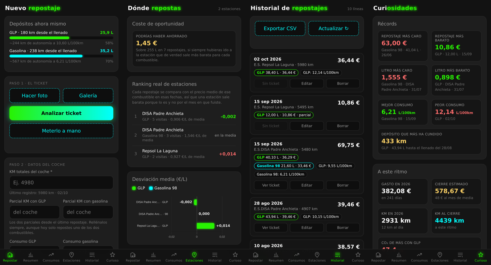
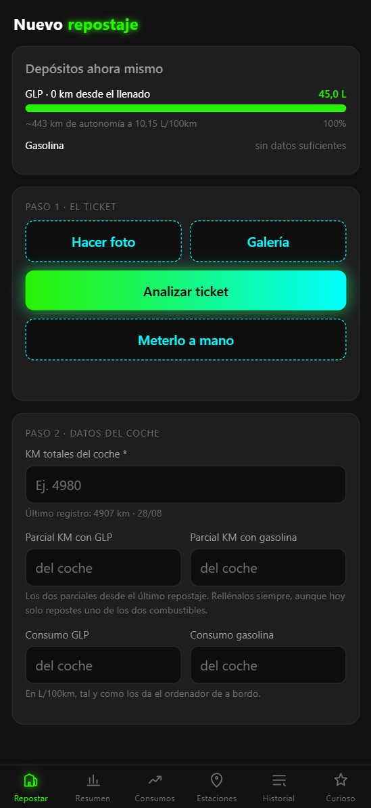
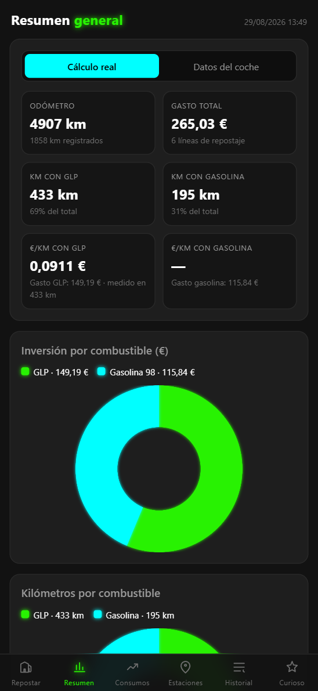
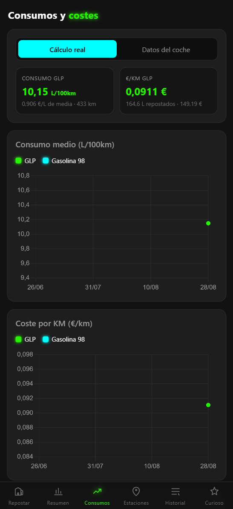
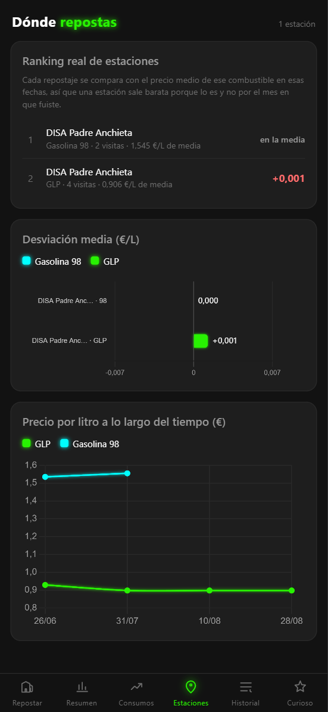
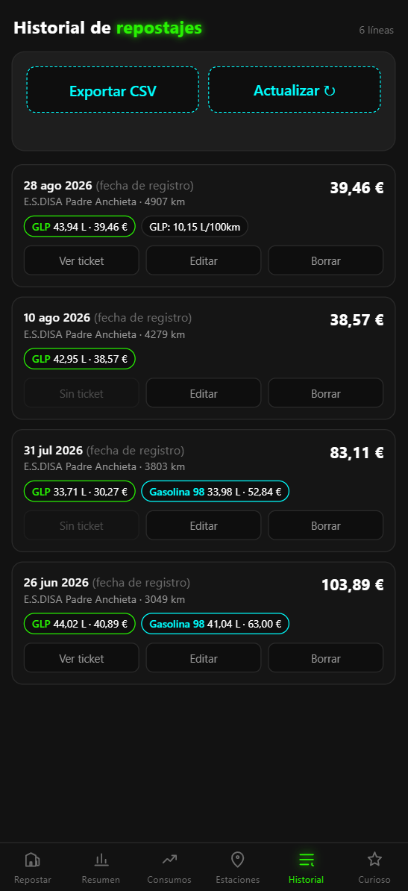
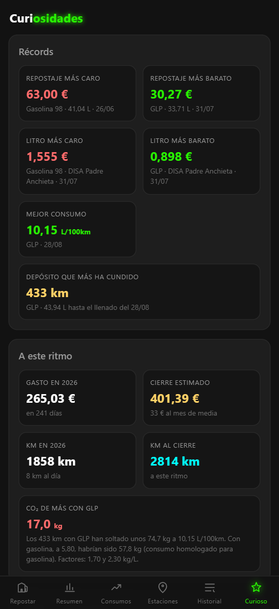

# RefuelControl

PWA para registrar los repostajes de un coche **bífuel GLP + gasolina** (Dacia Sandero Stepway ECO-G 120).

Haces una foto del ticket, la IA extrae los datos, tú los revisas y se guardan en Google Sheets. El dashboard vive dentro de la propia app, repartido en seis módulos que se recorren deslizando el dedo.

**Demo:** https://repostajesgofio.netlify.app/



---

## Qué resuelve

En un coche bífuel el consumo no se puede repartir: si llenas 40 L de GLP y 30 L de gasolina en el mismo ticket, no sabes cuántos kilómetros hiciste con cada uno. La mayoría de apps de repostajes lo estiman y el número sale mal.

Aquí introduces los dos parciales que da el ordenador de a bordo, y el cálculo se hace contra los kilómetros reales de cada combustible, acumulados desde la última vez que llenaste **ese** depósito.

---

## Funciona así

```
[Móvil] foto del ticket + KM y parciales del ordenador de a bordo
   │  la foto se reduce a 1400 px en el propio móvil (los HEIC del iPhone pasan a JPEG)
   ▼
[Netlify Function]  añade la URL del backend y el token, que nunca llegan al navegador
   ▼
[Apps Script]  guarda la foto en Drive → Gemini 2.5 Flash lee el ticket
   ▼
[Móvil] revisas fecha, estación, litros y precios, y marcas si llenaste el depósito
   │  antes de enviar se valida el odómetro, los parciales y la coherencia del ticket
   ▼
[Apps Script]  escribe una fila por combustible y recalcula toda la hoja
   ▼
[Móvil] el dashboard se repinta con Chart.js
```

---

## Stack

| Capa | Tecnología |
|---|---|
| Front | HTML + CSS + JS sin framework, Chart.js por CDN, PWA con service worker |
| Offline | IndexedDB para la cola de repostajes pendientes |
| Hosting | Netlify |
| Proxy | Netlify Function (Node) — guarda las claves |
| Backend | Google Apps Script desplegado como aplicación web |
| IA | Gemini 2.5 Flash (visión) |
| Datos | Google Sheets |
| Ficheros | Google Drive |

Sin base de datos propia, sin servidor que mantener y con coste cero dentro de las capas gratuitas.

---

## Qué hay en el repo

Una cosa, un archivo. Módulos ES nativos, sin paso de compilación: Netlify publica los archivos tal cual.

```
index.html              Solo el marcado de los seis módulos de la pantalla
css/estilos.css         Todos los estilos
js/
  app.js                Arranque: monta las piezas y reparte quién pinta qué
  config.js             El coche activo, colores, CO2 y demás constantes
  formato.js            Euros, kilómetros y fechas         <- puro, con pruebas
  calculo.js            Agregados y desviación por estación <- puro, con pruebas
  validacion.js         Reglas de la validación previa     <- puro, con pruebas
  datos.js              Guarda la última respuesta del backend y la reparte
  api.js                Lo único que habla con /api/repostaje
  offline.js            Cola en IndexedDB y sincronización
  ubicacion.js          Geolocalización y estación más cercana
  bloqueo.js            Pantalla del código de acceso
  navegacion.js         El carril de módulos y la barra de pestañas
  refresco.js           Tirar hacia abajo y refresco al volver a la app
  servicio.js           Registro del service worker
  dom.js                Los cuatro atajos del DOM
  ui/                   Un archivo por módulo, más graficos.js y depositos.js
apps-script/            El backend, partido por responsabilidades (00_Config … 09_Menu)
  appsscript.json       Manifiesto del script: zona horaria y permisos
manifest.json           Manifiesto de la PWA
sw.js                   Service worker, estrategia red primero
netlify.toml            Publicación y redirección de /api
netlify/functions/      El proxy: guarda la URL del backend y el token, y valida el código
img/                    Iconos de la PWA y capturas de pantalla
test/                   Bancos de pruebas y prueba de humo en Chromium
```

Lo que calcula no toca ni el DOM ni la red: `formato.js`, `calculo.js` y `validacion.js` reciben datos y devuelven datos, así que se prueban sin navegador. La red vive entera en `api.js`.

**Si añades un archivo al front, méte­lo en la lista `ESTATICOS` de `sw.js`.** Si no, la app deja de funcionar sin cobertura y no avisa; `test/rutas.test.js` lo comprueba por ti. Con los iconos pasa lo mismo en tres sitios: el `apple-touch-icon` de `index.html`, el array `icons` de `manifest.json` y esa misma lista.

Con módulos ES, abrir `index.html` con doble clic (`file://`) ya no vale: hay que servirlo. Para desarrollo sirve el servidor que levanta `node test/pantalla.js`.

---

## Montarlo desde cero

### 1. Google Sheets y Apps Script

1. Crea una hoja de cálculo. En la primera pestaña, pon `ID` en la celda **A1**: el script localiza la hoja por ese valor.
2. **Extensiones → Apps Script**. Crea un archivo por cada `.gs` de `apps-script/`, con el mismo nombre, y pega su contenido. Apps Script los mete a todos en el mismo ámbito global, así que el orden solo importa para leerlos.
3. **Configuración del proyecto → Propiedades del script**, y añade:

   | Propiedad | Valor |
   |---|---|
   | `GEMINI_API_KEY` | tu clave de [Google AI Studio](https://aistudio.google.com/apikey) |
   | `SHARED_TOKEN` | una cadena larga y aleatoria que inventes |
   | `CARPETA_RECIBOS_ID` | el ID de la carpeta de Drive donde guardar los tickets |

4. Marca **Mostrar el archivo de manifiesto `appsscript.json`** y pega el de `apps-script/`. Los permisos son estos:

   ```json
   "oauthScopes": [
     "https://www.googleapis.com/auth/drive",
     "https://www.googleapis.com/auth/spreadsheets",
     "https://www.googleapis.com/auth/script.external_request",
     "https://www.googleapis.com/auth/script.container.ui",
     "https://www.googleapis.com/auth/script.scriptapp"
   ]
   ```

   Sin `auth/drive` el script guarda los datos pero no las fotos, y falla en silencio. `script.scriptapp` solo hace falta para programar la copia semanal desde el menú; sin él, el disparador se crea a mano desde el editor.

5. Recarga la hoja y usa el menú **⛽ RefuelControl → Probar acceso a Drive**. Acepta los permisos. Debe responder `ok: true`.
6. **Implementar → Nueva implementación → Aplicación web**, con `Ejecutar como: Yo` y `Acceso: Cualquiera`. Copia la URL `/exec`.

### 2. Netlify

1. Conecta este repositorio a un sitio de Netlify. No hace falta comando de build.
2. **Site configuration → Environment variables**:

   | Variable | Valor |
   |---|---|
   | `GOOGLE_SCRIPT_URL` | la URL `/exec` del paso anterior |
   | `SHARED_TOKEN` | el mismo valor que pusiste en Apps Script |
   | `APP_PIN` | el código de acceso que teclearás en la app |

3. Despliega.

El `netlify.toml` ya redirige `/api/repostaje` a la función. El front no contiene ninguna clave, así que el repositorio puede ser público.

**Configura `APP_PIN` antes del primer despliegue.** Sin esa variable la función responde 500 y la app no funciona, que es justo lo que se busca: mejor cerrada que abierta. Usa algo largo, tipo frase, no cuatro dígitos.

### Código de acceso

La app es privada. Al abrirla pide un código, que se guarda en ese dispositivo y viaja en la cabecera `X-Codigo` de cada petición. La función de Netlify lo compara con `APP_PIN` en tiempo constante y responde **401** sin llegar a llamar al Apps Script cuando no cuadra, con 700 ms de espera para frenar los intentos a lo bruto. Lo que se protege es el endpoint, no solo la pantalla: saltarse la pantalla de bloqueo desde la consola del navegador no sirve de nada.

Para cambiar el código, cambia `APP_PIN` en Netlify, vuelve a desplegar y mételo de nuevo en cada dispositivo. El botón **«Olvidar el código en este móvil»** del Historial lo borra de ese dispositivo.

### 3. Instalar en el móvil

- **Android:** Chrome → menú → *Añadir a pantalla de inicio*.
- **iPhone:** Safari → compartir → *Añadir a pantalla de inicio*. Tiene que ser Safari.

---

## Esquema de la hoja

Una fila por combustible. Un ticket bífuel genera dos filas con el mismo ID.

| Col | Campo | Origen |
|---|---|---|
| A | ID | automático |
| B | Timestamp | automático |
| C | Estación | Gemini, editable |
| D | Tipo Combustible | Gemini, editable |
| E | Litros | Gemini, editable |
| F | Precio por Litro (€) | Gemini, editable |
| G | Total Invertido (€) | Gemini, editable |
| H | KM Totales | manual |
| I | KM Recorridos (tramo) | calculado |
| J | Lectura KM GLP (coche) | manual |
| K | Lectura KM Gasolina (coche) | manual |
| L | KM GLP (tramo) | calculado |
| M | KM Gasolina (tramo) | calculado |
| N | Consumo coche (L/100km) | manual |
| O | Consumo real (L/100km) | calculado |
| P | Coste por KM real (€/km) | calculado |
| Q | Coste por KM coche (€/km) | calculado |
| R | Enlace Recibo | automático |
| S | KM de este combustible desde su último repostaje | calculado |
| T | Depósito lleno | manual, marcado por defecto |
| U | Fecha del ticket | Gemini, editable |
| V | Latitud | GPS del móvil |
| W | Longitud | GPS del móvil |

Una segunda pestaña, **«Copia de seguridad»**, guarda todos los repostajes que han existido con dos columnas más: *Borrado* y *Fecha de baja*. Se sincroniza sola en cada recálculo, así que un borrado desde la app nunca pierde los datos.

La hoja guarda valores, no fórmulas. `recalcularTodo()` regenera todas las columnas calculadas a partir de los datos de entrada.

Si vienes de una versión anterior, el menú **⛽ RefuelControl → Actualizar esquema** crea las columnas que falten, marca como llenos los repostajes ya registrados, genera la copia de seguridad y recalcula la hoja. Es idempotente.

---

## Cómo se calcula el consumo

El método es tanque a tanque: cuando repostas un combustible llenas ese depósito, así que los litros de este repostaje son exactamente los que gastaste desde el anterior.

- **Tramo de un combustible** = la lectura del parcial del coche, porque los parciales se resetean después de cada repostaje. Si no los reseteas, cambia `CONTADORES_SE_RESETEAN` a `false` y el tramo pasa a ser la diferencia entre lecturas.
- **KM del cálculo** = suma de los tramos de ese combustible desde la última vez que se repostó. Necesario porque no siempre se repostan los dos: puedes llenar solo GLP tres veces seguidas mientras la gasolina sigue acumulando kilómetros.
- **Consumo real** = litros ÷ km del cálculo × 100.
- **Coste por km real** = euros ÷ km del cálculo.
- **Depósito lleno**: todo lo anterior asume que al repostar llenas ese depósito. Cuando echas una cantidad suelta, desmarcas la casilla y ese repostaje no cierra la ventana: sus litros y sus euros se suman al siguiente llenado, que es el único que puede dar un consumo honesto.
- **Consumo coche** y **coste por km coche** salen de lo que marca el ordenador de a bordo, y sirven para contrastar. El dashboard tiene un interruptor entre las dos versiones.

Cuando falta algún parcial de la ventana, el consumo se deja vacío en lugar de inventar un número. También aparece un aviso si los km de los dos combustibles no cuadran con el tramo total, que suele significar un parcial sin resetear.

Las medias del dashboard van **ponderadas por kilómetros**: el €/km de un combustible es la suma de sus euros dividida entre la suma de sus kilómetros, no el promedio de los €/km de cada repostaje. Con la media aritmética, un tramo de 100 km pesaba igual que uno de 500 y el resultado se inclinaba hacia los tramos cortos.

---

## La app por dentro

Seis módulos en un carril horizontal con `scroll-snap`, así que el deslizamiento lo resuelve el navegador y en iOS va como una app nativa. Abajo, una barra de pestañas; en escritorio funcionan además las flechas del teclado y unos botones laterales, y el contenido se queda en una columna centrada en lugar de estirarse. Los gráficos de cada módulo se dibujan la primera vez que se entra.

Los datos se actualizan de tres maneras: tirando hacia abajo en cualquier módulo, al volver a la app después de tenerla en segundo plano y con el botón del Historial. El gesto solo entra cuando el módulo está arriba del todo y el dedo baja en vertical, así que el deslizamiento lateral entre módulos sigue intacto.

<table>
  <tr>
    <td width="33%" align="center">
      <br>
      <b>Repostar</b><br>
      <sub>Cuánto queda en los depósitos, foto del ticket y datos del coche</sub>
    </td>
    <td width="33%" align="center">
      <br>
      <b>Resumen</b><br>
      <sub>Odómetro, gasto, €/km, rentabilidad y punto de equilibrio</sub>
    </td>
    <td width="33%" align="center">
      <br>
      <b>Consumos</b><br>
      <sub>Consumo y €/km de cada combustible, y su evolución</sub>
    </td>
  </tr>
  <tr>
    <td width="33%" align="center">
      <br>
      <b>Estaciones</b><br>
      <sub>Ranking real por desviación y coste de oportunidad</sub>
    </td>
    <td width="33%" align="center">
      <br>
      <b>Historial</b><br>
      <sub>Cada repostaje con su ticket, editable y exportable</sub>
    </td>
    <td width="33%" align="center">
      <br>
      <b>Curiosidades</b><br>
      <sub>Récords, proyección del año, CO₂ y ficha técnica</sub>
    </td>
  </tr>
</table>

---

## Qué mide el dashboard

**Punto de equilibrio**: con los consumos reales de los dos combustibles, hasta qué precio por litro compensa el GLP frente al precio de gasolina que pagas ahora mismo.

**Ahorro con GLP**: la cifra medida sobre los kilómetros con consumo calculado y, debajo, la proyección a todos los kilómetros recorridos con GLP. Lo medido y lo estimado nunca se mezclan.

**Ranking real de estaciones**: comparar precios medios mezcla fechas, y una gasolinera parece cara solo porque fuiste en un pico. Aquí cada repostaje se compara con la media de *ese mismo producto* en una ventana de ±45 días alrededor de su fecha, y lo que ordena el ranking es esa desviación.

**Coste de oportunidad**: lo que habrías ahorrado repostando siempre en la estación que de verdad sale más barata. Solo aparece con dos o más estaciones del mismo combustible.

**Autonomía**: cuánto queda en cada depósito, estimado con el consumo medido y los kilómetros desde el último llenado.

**Curiosidades**: récords, proyección del gasto y los kilómetros al cierre del año, CO₂ evitado frente a hacer esos mismos kilómetros con gasolina, y desviación respecto al consumo homologado.

El eje temporal de las series es la lista de tickets, no la de fechas, así que dos repostajes del mismo día se ven como dos puntos.

---

## Registrar sin cobertura

Muchas gasolineras cubiertas no tienen señal. Si no hay conexión, «Meterlo a mano» abre la pantalla de revisión en blanco y el repostaje se guarda en IndexedDB con la foto incluida; se sube solo en cuanto vuelve la red. Lo mismo si el servidor no responde estando en línea. Mientras quede algo pendiente, la pestaña Repostar lleva un punto ámbar.

---

## Editar, borrar y exportar

Desde el módulo Historial se corrige cualquier campo de un repostaje y se borra con confirmación. La edición conserva la posición de la fila, que es lo que define el orden cronológico del motor de cálculo, y admite pasar un ticket de uno a dos combustibles o al revés.

Borrar no destruye nada: la pestaña «Copia de seguridad» conserva la fila marcada como borrada, con su fecha de baja.

El botón **Exportar CSV** descarga el histórico entero, separado por punto y coma y con coma decimal, listo para abrir en Excel.

---

## Copias de seguridad

Son dos, para dos sustos distintos.

**La pestaña «Copia de seguridad»** protege de un borrado desde la app: conserva todas las filas que han existido, marcadas como vivas o borradas. Se sincroniza sola en cada recálculo.

**La copia semanal** protege de perder la hoja de cálculo entera. Duplica el libro completo en una carpeta de Drive junto al original y conserva las ocho últimas, mandando las viejas a la papelera. Se activa desde el menú **⛽ RefuelControl → Copias de seguridad → Programar copia semanal**, que crea el disparador de los lunes de madrugada y hace la primera copia en el momento. Ese mismo submenú tiene *Copiar el libro ahora*, *Cancelar* y *Ver estado*, y el estado sale también en `?action=ping`.

Si el disparador falla por permisos, el aviso lo dice: hay que añadir el scope `script.scriptapp` al manifiesto o crear el activador a mano desde el editor (función `copiaSemanal`, según tiempo, semanal).

---

## Pruebas

```bash
npm test              # cinco bancos sin dependencias
node test/pantalla.js # prueba de humo en Chromium (necesita playwright y chart.js)
```

`npm test` descubre solo los bancos de `test/`:

| Banco | Qué comprueba |
|---|---|
| `motor.test.js` | Carga los `.gs` de `apps-script/` con un Sheet simulado, así que prueba el código que se despliega |
| `dashboard.test.js` | Importa `js/calculo.js` de verdad y comprueba los agregados con datos de ejemplo |
| `validacion.test.js` | Las reglas de la validación previa, caso a caso |
| `rutas.test.js` | Que todo lo que se importa existe y está en el service worker |
| `Seguridad.test.js` | Mete peticiones simuladas en la función de Netlify de verdad: sin código no se llega al Apps Script |

La prueba de humo recorre los seis módulos en Chromium y comprueba además la pantalla de bloqueo, el gesto de tirar hacia abajo y el borrado.

---

## Aviso

Es un proyecto personal, pensado para un coche y un conductor. No es multiusuario ni cuenta con que dos personas escriban a la vez. Cógelo como punto de partida.

## Licencia

MIT.